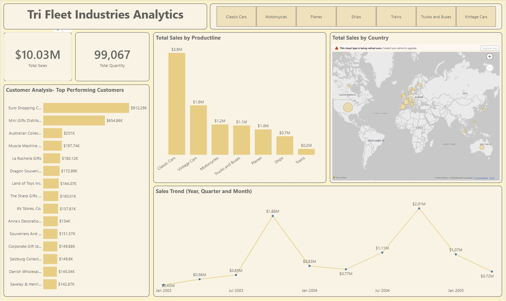
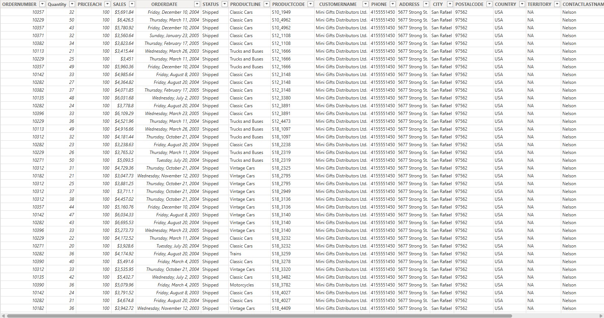
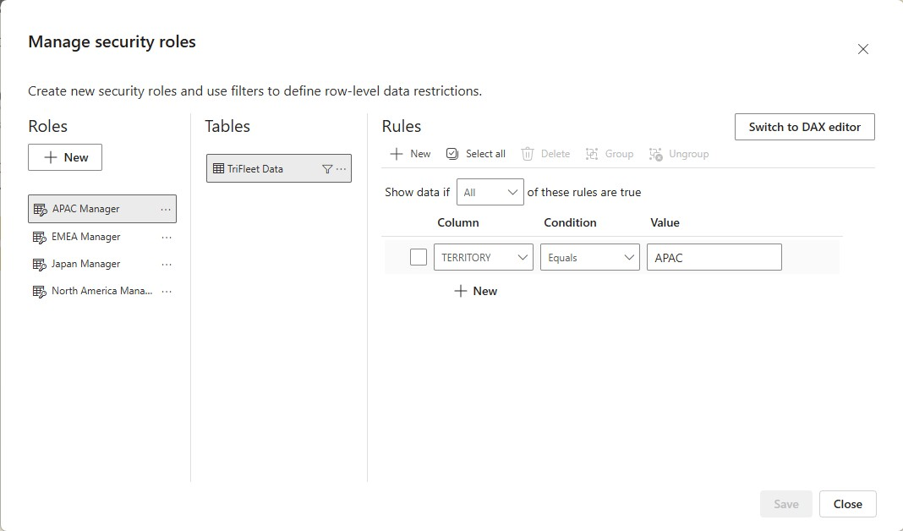

# 🚗 Tri Fleet Industries — Sales Analytics Dashboard (Power BI)

> An interactive Power BI dashboard analysing global sales performance across seven product lines for Tri Fleet Industries, a scale model vehicle distributor operating from 2003 to 2005.

---

## 📌 Project Overview

This project analyses transactional order data for Tri Fleet Industries, tracking total revenue, quantity sold, top-performing customers, product line performance, and global sales distribution across multiple territories.

**Business questions answered:**
- Which product lines drive the most revenue — and which underperform?
- Who are the top customers by total sales value?
- How does sales performance trend across years, quarters, and months?
- Which countries and territories generate the highest sales volume?
- How can the business filter performance by individual product category?

---

## 📊 Dashboard

### Sales Analytics — Main Page

| Visual | Insight |
|---|---|
| KPI Cards | $10.03M total sales · 99,067 total quantity sold |
| Bar — Total Sales by Product Line | Classic Cars dominate at $3.9M · Vintage Cars second at $1.9M · Trains lowest at $0.2M |
| Bar — Top Performing Customers | Euro Shopping C. leads at $912K · Mini Gifts Distrib. second at $655K |
| Line — Sales Trend (Year, Quarter, Month) | Strong peak in Jan 2004 ($1.86M) and Jan 2005 ($2.01M) — clear seasonal pattern |
| Map — Total Sales by Country | Global distribution across North America, Europe, Asia, and Australia |
| Buttons — Product Line Filter | Classic Cars · Motorcycles · Planes · Ships · Trains · Trucks and Buses · Vintage Cars |

---

## 🗄️ Dataset

Transactional order-level data covering 2003–2005 with the following fields:

| Field | Description |
|---|---|
| `ORDERNUMBER` | Unique order identifier |
| `Quantity` | Units ordered per line item |
| `PRICEEACH` | Unit price (consistent at $100 across records) |
| `SALES` | Total revenue per line item |
| `ORDERDATE` | Date the order was placed |
| `STATUS` | Order fulfilment status (e.g. Shipped) |
| `PRODUCTLINE` | Category (Classic Cars, Vintage Cars, Motorcycles, Trucks and Buses, Planes, Ships, Trains) |
| `PRODUCTCODE` | Unique product identifier |
| `CUSTOMERNAME` | Customer business name |
| `PHONE` | Customer contact number |
| `ADDRESS` | Customer street address |
| `CITY` | Customer city |
| `POSTALCODE` | Customer postal code |
| `COUNTRY` | Customer country |
| `TERRITORY` | Sales territory (e.g. NA, EMEA, APAC) |
| `CONTACTLASTNAME` | Primary contact surname |

---

## 🛠️ Tools & Techniques

- **Power BI Desktop** — report design, DAX measures, data modelling
- **Power Query** — data cleaning, date formatting, column profiling
- **DAX** — measures for Total Sales, Total Quantity, customer ranking
- **Row Level Security (RLS)** — territory-based access control implemented on the `TriFleet Data` table using static filters on the `TERRITORY` column. Four roles configured:

  | Role | Table | Column | Condition | Value |
  |---|---|---|---|---|
  | APAC Manager | TriFleet Data | TERRITORY | Equals | APAC |
  | EMEA Manager | TriFleet Data | TERRITORY | Equals | EMEA |
  | Japan Manager | TriFleet Data | TERRITORY | Equals | Japan |
  | North America Manager | TriFleet Data | TERRITORY | Equals | NA |

  Each role restricts the report view to only the rows matching that manager's assigned territory — ensuring regional managers see only their own data when the report is shared internally.

  
- **Button slicers** — product line filter applied across all visuals
- **Bing Maps** — global sales distribution by country/territory
- **Bar charts** — product line and customer performance ranking
- **Line chart** — sales trend with drill-down by year, quarter, and month

---

## 💡 Key Findings

- **Classic Cars are the clear revenue leader** at $3.9M — nearly double Vintage Cars ($1.9M) in second place. The remaining five product lines contribute far less, with Trains at just $0.2M representing a potential discontinuation candidate
- **Two customers account for a disproportionate share of revenue** — Euro Shopping C. ($912K) and Mini Gifts Distributors ($655K) together represent over 15% of total sales. This concentration is a business risk worth monitoring
- **A strong January sales spike is visible in both 2004 and 2005** — peaking at $1.86M and $2.01M respectively — suggesting seasonal demand cycles tied to the holiday/gifting period
- **Mid-year sales consistently dip** (Jul 2003: $0.56M, Jul 2004: $0.77M), indicating a predictable slow season where promotional activity could be targeted
- **Sales are globally distributed** with strong concentration in Europe and North America — the APAC and South American territories appear underrepresented and could be growth opportunities
- **All recorded unit prices are $100**, suggesting this dataset captures a standardised wholesale pricing model rather than variable retail pricing

---

## 🔗 Live Dashboard

**[👉 View the interactive report on Power BI Service](https://app.powerbi.com/view?r=eyJrIjoiN2QzODlkN2ItOTc2Yy00NzA3LWI0N2YtNmRhZGE0YWRmNzViIiwidCI6IjhmMzdmNjM3LWI2MGEtNGY0OS04ZGVmLTgxODU2YTI0ODg5ZSJ9)**

> Fully interactive — use the product line buttons to filter all visuals and explore performance by category.

> **Note on RLS:** The original report implements Row Level Security restricting each regional manager's view to their own territory (APAC, EMEA, Japan, North America). The published version above displays full data for portfolio purposes.

---

## 📁 Files in This Repository

| File | Description |
|---|---|
| `trifleet_dashboard.jpg` | Screenshot — main dashboard |
| `trifleet_data_table.jpg` | Screenshot — raw data table |
| `trifleet_rls.jpg` | Screenshot — Row Level Security configuration (4 territory-based roles) |

---

## 👤 Author

**Divine Abbah** — Data Analyst  
📧 divineabbah7@gmail.com  
🌐 [LinkedIn](https://linkedin.com/in/divineabbah)
